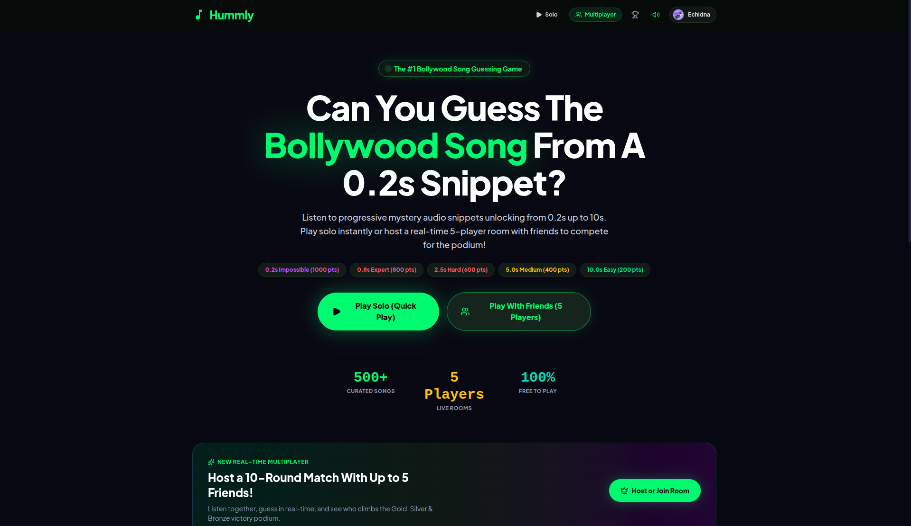

# 🎵 Hummly — The Ultimate Bollywood & Desi Music Guessing Game

<div align="center">



**Listen to short mystery snippets, guess the track in stages, and battle your friends in real-time.**  
Featuring **750+ curated Bollywood, Punjabi, Retro, Party, and Romantic hits**!

[](https://nextjs.org/)
[](https://www.typescriptlang.org/)
[](https://tailwindcss.com/)
[](https://supabase.com/)
[](https://vercel.com/)

**Created with 💚 by [Hilal Ahmad](https://github.com/HilalAhmad01)**

</div>

---

## 🌟 Key Features

### 🎧 Progressive Audio Snippet Engine
- Guess the track across **5 progressive difficulty stages**:
  - 🟣 **Impossible (0.2s)** — 1,000 pts *(for the true musical savants)*
  - 🔴 **Expert (0.8s)** — 800 pts
  - 🟠 **Hard (2.5s)** — 600 pts
  - 🟡 **Medium (5.0s)** — 400 pts
  - 🟢 **Easy (10.0s)** — 200 pts
- **Anti-Exploit Protection**: Unlocking a longer snippet permanently locks previous shorter stages for that round, preventing retroactively claiming higher points.

### ⚔️ Real-Time Multiplayer Arena
- **Instant Room Creation**: Create private lobbies with a unique 6-character room code.
- **Cross-Device Sync**: Play live with friends across phones, laptops, and tablets with automated countdown timers, simultaneous snippet unlocks, and standup scoreboards.
- **Victory Podium & Rematch**: Top 3 players celebrate on an animated podium. The host can restart a fresh 10-round match in the same room with one click (`Play Again with Same Lobby`).

### 🔍 Lightning-Fast Autocomplete
- Powered by in-memory **Fuse.js fuzzy search** (sub-5ms response time).
- Search effortlessly across **750+ songs** by track title, movie/album name, or singer.

### 🎼 Rich Curated Music Collections
- 🌟 **All Bollywood Hits** (Full 750+ track shuffle pool)
- 🔥 **Punjabi Songs** (*150+ mega hits from Sidhu Moose Wala, Karan Aujla, Shubh, AP Dhillon, Diljit Dosanjh, Navaan Sandhu, Arjan Dhillon*)
- 💃 **Party & Dance Bangers** (*150+ high-energy club anthems from Badshah, Honey Singh, Pritam, Guru Randhawa*)
- 💖 **Romantic Melodies** (*100+ soulful love ballads from Arijit Singh, Atif Aslam, KK, The Local Train, Anuv Jain*)
- ⚡ **2020s Chartbusters** (*Animal, Brahmāstra, Jawan, Stree 2, Bad Newz*)
- 🎸 **Golden 2010s** (*Aashiqui 2, YJHD, Rockstar, Tamasha, ADHM*)
- 🎧 **Nostalgic 2000s** (*Kal Ho Naa Ho, Jab We Met, K3G, Dil Chahta Hai*)
- 📻 **90s Retro Classics** (*DDLJ, Saajan, Kuch Kuch Hota Hai, Khal Nayak, Mohra*)

### 🏆 Profiles & Global Leaderboards
- Track high scores, games played, win rate, and guess speed.
- Weekly and all-time global leaderboards powered by Supabase Postgres.

---

## 🛠️ Tech Stack

- **Framework**: [Next.js 16 (App Router)](https://nextjs.org/)
- **Language**: [TypeScript](https://www.typescriptlang.org/)
- **Styling**: [Tailwind CSS](https://tailwindcss.com/) with custom dark glassmorphic design system
- **Database & Realtime**: [Supabase](https://supabase.com/) (PostgreSQL & Row Level Security)
- **Audio Delivery**: Native HTML5 `<audio>` engine with official streaming CDNs (0 bandwidth rehosted)
- **Search Engine**: [Fuse.js](https://fusejs.io/) in-memory fuzzy index
- **Analytics**: [@vercel/analytics](https://vercel.com/analytics)
- **Deployment**: [Vercel](https://vercel.com/)

---

## 🚀 Getting Started Locally

### Prerequisites
- Node.js 18+ installed
- npm or pnpm

### 1. Clone the repository
```bash
git clone https://github.com/HilalAhmad01/Hummly.git
cd Hummly
```

### 2. Install dependencies
```bash
npm install
```

### 3. Set up Environment Variables
Create a `.env.local` file in the project root:
```env
NEXT_PUBLIC_SUPABASE_URL=your-supabase-project-url
NEXT_PUBLIC_SUPABASE_ANON_KEY=your-supabase-anon-key
```

### 4. Run the development server
```bash
npm run dev
```
Open [http://localhost:3000](http://localhost:3000) in your browser.

---

## 🌐 Deployment to Vercel

1. Push your code to your GitHub repository.
2. Go to [Vercel Dashboard](https://vercel.com) and click **"Add New Project"**.
3. Import `HilalAhmad01/Hummly`.
4. Configure the environment variables (`NEXT_PUBLIC_SUPABASE_URL`, `NEXT_PUBLIC_SUPABASE_ANON_KEY`).
5. Click **Deploy**. Vercel will automatically build and publish your game globally!

---

## 👨‍💻 Author

**Hilal Ahmad**  
- GitHub: [@HilalAhmad01](https://github.com/HilalAhmad01)
- Project: [Hummly](https://github.com/HilalAhmad01/Hummly)

---

## ⚖️ Legal & Copyright Disclaimer
Hummly is a non-commercial educational & trivia project for music enthusiasts. All audio previews (30 seconds) are streamed directly from official public content delivery networks under standard preview terms. Zero unlicensed audio is stored or redistributed.
